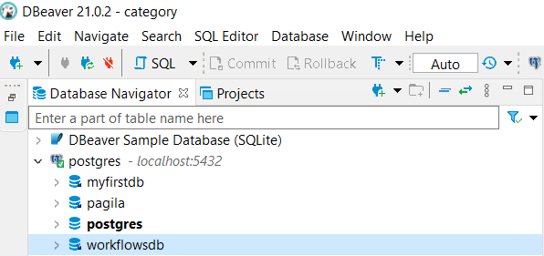
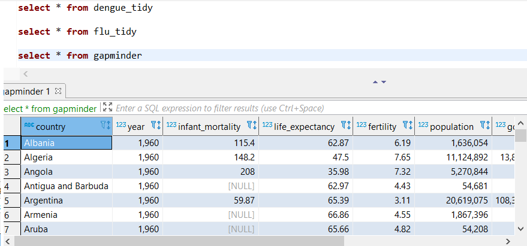

```{r setup06, include=FALSE}
library(tidyverse)
library(dslabs)
library(tidyr)
library(RPostgreSQL)
```

# SQL and R

In this part of my portfolio I will import 3 data files into SQL.

First, the flu and dengue data files will be downloaded and the gapminder data from _dslabs_ has also been used.

```{r download and import files, message=FALSE, warning=FALSE}
download.file("https://raw.githubusercontent.com/DataScienceILC/tlsc-dsfb26v-20_workflows/main/data/flu_data.csv", destfile="data/flu.data.csv")

download.file("https://raw.githubusercontent.com/DataScienceILC/tlsc-dsfb26v-20_workflows/main/data/dengue_data.csv", destfile="data/dengue_data.csv")

flu_data <- read_csv("data/flu.data.csv", 
                     skip = 10)
dengue_data <- read_csv("data/dengue_data.csv",
                        skip = 11)
gapminder <- dslabs::gapminder
```

After the import, the data has been made tidy.

```{r tidying flu and dengue}
flu_tidy <- flu_data %>% pivot_longer(matches(colnames(flu_data[2:30])), names_to="country", values_to ="flu_value")

dengue_tidy <- dengue_data %>% pivot_longer(matches(colnames(dengue_data[2:11])), names_to="country", values_to="dengue_value")
```

After this the date should be seperated to be the same as the gapminder date and the data should be the same class.

```{r separating date and assigning classes, message=FALSE}
# separating date
flu_tidy <- separate(flu_tidy, Date, into=c("year", "month", "day"), sep="-")
dengue_tidy <-separate(dengue_tidy, Date, into=c("year", "month", "day"), sep="-")

# assigning numeric class to year and factor to country.
flu_tidy$year <- as.numeric(flu_tidy$year)
flu_tidy$country <- as.factor(flu_tidy$country)
dengue_tidy$year <- as.numeric(dengue_tidy$year)
dengue_tidy$country <- as.factor(dengue_tidy$country)

# making each year the mean
flu_tidy <- flu_tidy %>% group_by(year, country) %>% summarize("year"=year, "country"=country, "flu_value"=(mean(flu_value, na.rm=TRUE)%>%round(digits=0))) %>% unique()
dengue_tidy <- dengue_tidy %>% group_by(year, country) %>% summarize("year"=year, "country"=country, "dengue_value"=(mean(dengue_value, na.rm=TRUE)%>%round(digits=3))) %>% unique()

```

Now that the data has an uniform format with the same classes and columns, it will be saved as .csv and .rds

```{r saving data}
# writing csv
write_csv(dengue_tidy, here::here("data/dengue_tidy.csv"))
write_csv(flu_tidy, here::here("data/flu_tidy.csv"))
write_csv(gapminder, here::here("data/gapminder.csv"))

# writing rds
write_rds(dengue_tidy, here::here("data/dengue_tidy.rds"))
write_rds(flu_tidy, here::here("data/flu_tidy.rds"))
write_rds(gapminder, here::here("data/gapminder.rds"))
```

In DBeaver, a workflowsdb has been made to store this data in. The database is colored blue in the picture.

```{r picture databases, out.width="80%", fig.cap="Figure 1: Databases in DBeaver"}

```

Now, it's time to make a connection with our database inside R!

```{r connect to database}
con <- dbConnect(RPostgres::Postgres(), 
                 dbname = "workflowsdb", 
                 host="localhost", 
                 port="5432", 
                 user="postgres", 
                 password="Shervin.Kaandorp")
```

Let's write the tables into the database.

```{r table into database}
# overwrite=TRUE has been set to dodge the error when knitting the RMD.
dbWriteTable(con, "dengue_tidy", dengue_tidy, overwrite=TRUE)
dbWriteTable(con, "flu_tidy", flu_tidy, overwrite=TRUE)
dbWriteTable(con, "gapminder", gapminder, overwrite=TRUE)
```

Now I'll inspect wether or not the tables have been written correctly into the database. To see this, I used ``SELECT * from <table>`` inside DBeaver. In figure 2 you can see the output for the gapminder table.

```{r inspecting database, out.width="80%", fig.cap="Figure 2: Inspecting the tables in DBeaver"}

```

Inspecting the tables within R can easily be done with ``head()`` command. output has not been shown due to it not being relevant for this markdown.

```{r inspecting in R, eval=FALSE}
head(dengue_tidy)
head(flu_tidy)
head(gapminder)
```

Or a connection within R can be made with the database, retrieving the tables with SQL. I will demonstrate this only with the flu_tidy table.

```{sql inspecting with sql, connection=con}
SELECT * FROM flu_tidy
```

Now we will edit the gapminder, flu and dengue table so it can be left joined with the flu and dengue data.

```{r edit to leftjoin, message=FALSE, warning=FALSE}
sql_gap <- dbReadTable(con, "gapminder")
sql_gap <- sql_gap %>% filter(year==unique(dengue_tidy$year))
dbWriteTable(con, "gapminder_clean", sql_gap, overwrite=TRUE)
```

I will now left join using SQL and i will write this to another table inside the database.

```{sql leftjoin, connection=con}
create table gapminder_flu_dengue as
select gapminder_clean.*, flu_tidy.flu_value, dengue_tidy.dengue_value 
from gapminder_clean 
left join flu_tidy 
on flu_tidy.country = gapminder_clean.country 
and flu_tidy."year" = gapminder_clean."year" 
left join dengue_tidy on dengue_tidy.country = gapminder_clean.country 
and dengue_tidy."year" = gapminder_clean."year"
```

Now we are able to import this table from the database to make some beautiful ggplot2 graphs. After this we will not use the database again, therefore we will close the connection.
```{r import table}
gapminder_flu_dengue <- dbReadTable(con, "gapminder_flu_dengue")
dbDisconnect(con)
```

```{r graph 1}
gapminder_flu_dengue %>% 
  filter(flu_value>0) %>% 
  ggplot(aes(x=year, y=flu_value)) + 
  geom_line(aes(colour=country)) + 
  geom_point(aes(colour=country)) +
  labs(title="Average flu values for countries between 2002 and 2015",
       x="Year", y="flu value",
       caption="Figure 3: data from gapminder, flu and dengue dataset. 
       The points in the graph are the only values which both has a year and a flu value.
       For the countries with multiple data points, we can see a negative trend.")
```

```{r graph 2}
gapminder_flu_dengue %>% 
  filter(dengue_value>0) %>% 
  ggplot(aes(x=year, y=dengue_value)) + 
  geom_line(aes(colour=country)) + 
  geom_point(aes(colour=country)) +
  labs(title="Average dengue values for countries between 2002 and 2015",
       x="Year", y="Dengue value",
       caption="Figure 4: data from gapminder, flu and dengue dataset. 
       The points in the graph are the only values which both has a year and a dangue value.")
```

```{r graph 3, message=FALSE}
gapminder_flu_dengue %>% 
  filter(flu_value>0 & dengue_value>0) %>% 
  ggplot(aes(x=dengue_value, y=flu_value)) + 
  geom_line(aes(colour=country)) + 
  geom_point(aes(colour=country)) +
  labs(title="Flu value to dengue value for countries between 2002 and 2015",
       x="Dengue value", y="Flue value",
       caption="Figure 5: data from gapminder, flu and dengue dataset. 
       The points in the graph are the only values which both has a dengue value and a flu value.
       Bolivia has a high flu value and a low dengue value while 
       Brazil has a low flu value and a high dengue value.")
```
