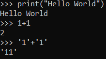

```{r setup, include=FALSE}
knitr::opts_chunk$set(echo = TRUE)
```

# Introduction in Python.

For my self study I started learning Python. Python is very interesting to me because it is the most used programming language in the world. I want to learn multiple coding languages to broaden myself. To learn python I am using the book 'Python for Bioinformatics' by Sebastian Bassi which learns me to use Python in shell and how to adapt bioinformatics in python. In this markdown I'll describe what I have learned from this guide.

## Part 1: Programming

To start my python journey I obviously have to know how strings, calculation and other basic principles work. I started printing 'Hello World' to the screen using ``print("Hello World")`` (see the figure) I've also seen the first big difference between R and Python. In Python, you can add strings together doing ``'Hello' + 'World'`` or ``'1'+'1'`` as seen below (the strings cannot be added toghether when the classes are not the same). This is not possible with R, this gives the error: ``Error in "1" + "1" : non-numeric argument to binary operator``. In R one should use ``paste('Hello','World')``.

```{r hello world!, echo=FALSE, out.width="20%"}

```

## Part 2: Using Biopython

## Part 3: Advanced Topics

## Part 4: Python Recipes