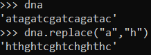

# Introduction in Python

For my self study I started learning Python. Python is very interesting to me because it is the most used programming language in the world. I want to learn multiple coding languages to broaden myself. To learn Python I am using the book 'Python for Bioinformatics' by Sebastian Bassi which learns me to use Python in shell and how to adapt bioinformatics in python. In this markdown I'll describe what I have learned from this guide.

## Part 1: Programming

To start my Python journey I obviously have to know how strings, calculation and other basic principles work. I started printing 'Hello World' to the screen using ``print("Hello World")`` (see the figure) I've also seen the first big difference between R and Python. In Python, you can add strings together doing ``'Hello' + 'World'`` or ``'1'+'1'`` as seen below (the strings cannot be added together when the classes are not the same). This is not possible with R, this gives the error: ``Error in "1" + "1" : non-numeric argument to binary operator``. In R one should use ``paste('Hello','World')``.

```{r hello world!, echo=FALSE, out.width="20%", fig.cap="Figure 1: hello world!"}
knitr::include_graphics("doc/helloworld.png")
```

The next thing I noticed was the use of functions. In Python you can add strings to a function easily by doing ``<string>.<function>()``. In the example I made a DNA strand called "dna" and I used the replace function to replace each a with an h (which isn't relevant but it shows how it works).

```{r piping, echo=FALSE, out.width="20%", fig.cap="Figure 2: replacing and input the dna"}

```

Also, numbers are different in Python. In R, if we say ``<string>[1]`` we get the first value in this string. But in python this is the second. Also when we say ``<string>[1:2]`` we get the first and second value in the string in R. In python we only get the second.

I will showcase some self evaluation assignments, which are inside the guide.

First i will make a program that checks whether or not a number is a palindrome.

Now i will make a program that asks for your name and writes it to MyName.txt.

## Part 2: Using Biopython


## Part 3: Advanced Topics

## Part 4: Python Recipes